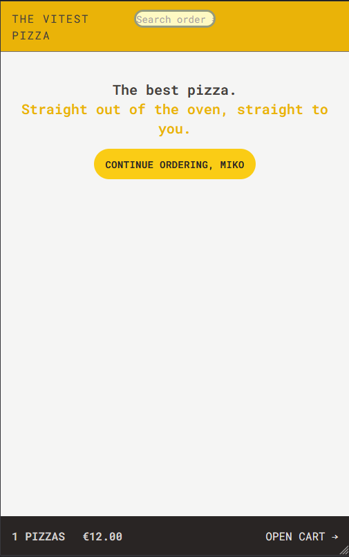
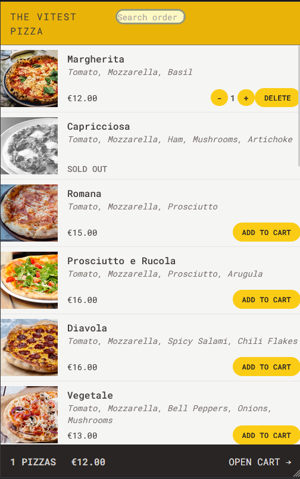
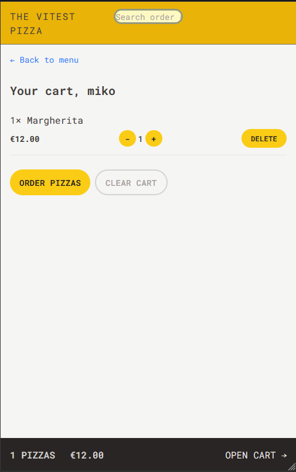
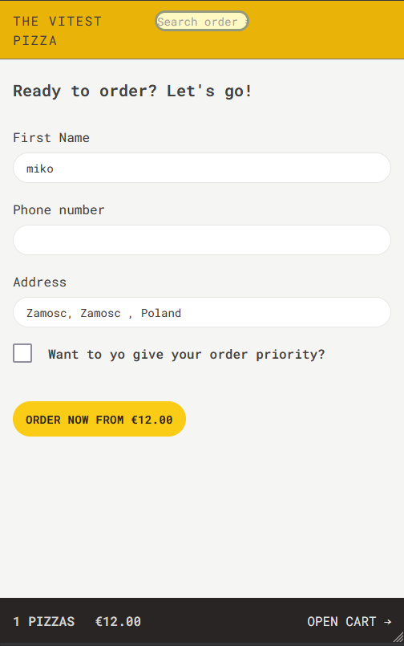

# The Vitest Pizza

The application allows you to browse the pizza menu and place orders. Use The Vitest Pizza quickly and conveniently thanks to its intuitive interface.

# Features
## ℹ️ Basic concept
The main idea of The Vitest Pizza was to create an easy-to-use website enabling placing orders. Getting to know technologies such as React Redux, React Router, REST API support and the use of tools such as Tailwind CSS and PostCSS.


## 🍕 Add pizzas
Choose from several items and compose your pizza order list.


## 📝🗺️ Order with geolocation
Place your order and use the geolocation API to avoid entering your address yourself.


## 🔍 Search
Search for your current orders and check their status.


## 📏 Responsiveness
Thanks to the use of Tailwind CSS, the application is responsive and adapts to the current screen resolution.






## Run Locally

Make sure you have Node and npm installed (https://nodejs.org/en)

Clone the project

```bash
  git clone https://github.com/dosmiko7/VitestPizza
```

Go to the project directory

```bash
  cd VitestPizza
```

Install dependencies

```bash
  npm install
```

Start the server

```bash
  npm run dev
```
By default, the local server will start at: http://localhost:5173/ 

## Demo

[https://vitestpizza-mo.netlify.app/](https://vitestpizza-mo.netlify.app/)


## Tech Stack
- Node v18.14.2
- npm v9.8.0
- React,
- JavaScript  
- Tailwind CSS, 
- React Redux Toolkit,
- React Router
- Vite
- REST API

## Author

Mikołaj Oberda 
[@dosmiko7](https://www.github.com/dosmiko7)

